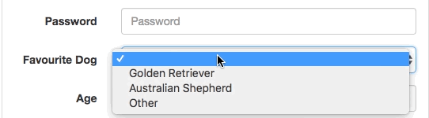
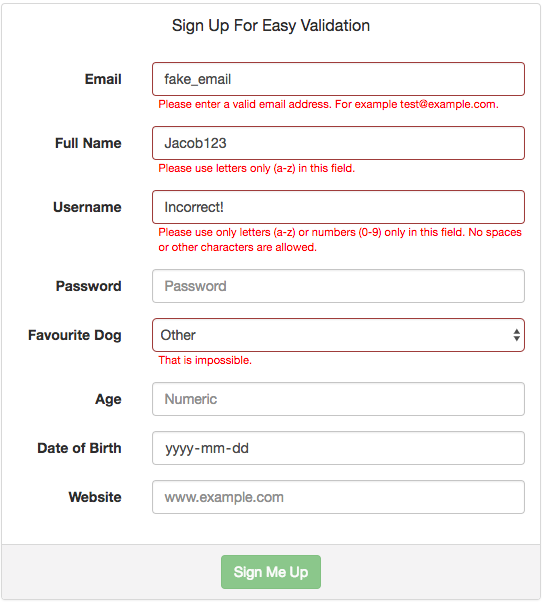

# Easy Validator
A jQuery module that validates form fields. You can create your own validations with validator functions, or you can use the ones that are built in.

## Prerequisities
- Jquery >= 1.11.1

## Installation
1. Clone this repository or simply download either `js/easy-validator.js` or `js/easy-validator.min.js`.
    - Note: `easy-validator.min.js` is a minified version of `js/easy-validator.js`. This means that it is a smaller file. If you want to update the scripts contents, then copy `js/easy-validator.js`. Otherwise, download the minified version.
2. Include the file in your project
```html
<script src="your/path/to/easy-validator.min.js"></script>
```

## Usage
You must simply add the validation name to the class of the input you want to validate.

### Custom Validations


```html
<script>
    EasyValidator.add("validate-selection", "That is impossible.", function(val) {
        return val !== "Other";
    })
</script>
```

You can create custom validations by using the easy-validator api. 

#### API
| EasyValidator Method | Parameters |
|----------------------|------------|
| add(name, message, func) | <b>name</b>: the class name that the validation affects. <br> <b>message</b>: The message to be displayed if the input is invalid. <br> <b>func</b>: The validation function. Takes in one parameter - the value of the input. |
| addValidations(arr)  | <b>arr</b>: Array of validations to be added to the validator. |

### Built-in Validations
| Validation           | Validates            | Message            |
|----------------------|----------------------|--------------------|


## Demo
Click [here](http://jacobsteves.ca/easy-validator) for a live demo.


